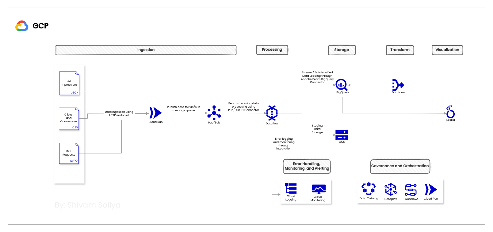

# AdvertiseX Data Architecture

## Real-time Data Ingestion System for AdvertiseX in GCP (All Sources)

I am proposing this architecture based on GCP platform for the AdvertiseX data engineering case study which addresses the case study requirements such as scalable data ingestion, data processing, data storage, and error handling.

### Data Sources and Formats Assumptions:

- **Ad Impressions (JSON):** Real-time data collection upon ad display.
- **Clicks & Conversions (CSV):** Real-time data collection upon user interactions.
- **Bid Requests (Avro):** Real-time data collection from RTB platforms during auctions.

All the data generated gets pushed to the unified endpoint of the system for processing and storage.

### 1. Data Ingestion Proposed Method:

**Scalable HTTP Endpoint with Base64 Encoding:**

For developing a scalable HTTP endpoint, I am proposing to use Cloud Run as it autoscales horizontally based on the data volume. 

This endpoint can accept real-time data pushes from various sources in their respective formats (JSON, CSV, Avro) and implement logic within the endpoint to perform base64 encoding or schema unification on the received data for efficient data transfer. 

Cloud Run with the ability to handle real-time data from all sources using a single scalable HTTP endpoint offers a great level of flexibility.

**Pub/Sub as a Messaging Queue:**

We can configure separate Pub/Sub topics for each data type (impressions, clicks, conversions).
The HTTP endpoint, Cloud Run, upon receiving data and performing base64 encoding, publishes it to the corresponding Pub/Sub topic. 

This step offers decoupling as it separates data ingestion from data processing, allowing for independent scaling.

### 2. Data Processing Proposed Method: 

**Cloud Dataflow for Unified Stream/Batch Data Processing:**

We can utilize Cloud Dataflow, a managed streaming dataflow service, for real-time as well as batch data processing. Here's a sample of operations that we can perform using Apache Beam (using Dataflow) to achieve our goals.

- **Read from Pub/Sub:** Use ReadFromPubSub transform to read data from each topic (impressions, clicks, conversions, real-time bidding).

- **Parse Data:** Utilize Map transforms to parse the data based on its format (e.g., Avro, JSON). Define parsing logic to extract relevant fields.

- **Data Validation:** 
Implement ParDo transforms with custom functions to validate data based on pre-defined rules. For example:
Impressions: Validate timestamps, user IDs, and ad IDs.
Clicks: Validate click timestamps, user IDs, ad IDs, and ensure clicks occur after impressions for the same user and ad.
Conversions: Validate conversion timestamps, user IDs, ad IDs, and ensure conversions occur after clicks for the same user and ad.
Real-time bidding: Validate bid prices, timestamps, and ad IDs.

- **Filtering:** Use Filter transforms to filter out invalid data based on the validation results.

- **Deduplication:** Apply CombinePerKey transforms with custom combiners to deduplicate data. For example:
Impressions: Deduplicate based on a unique combination of user ID, ad ID, and timestamp (assuming impressions shouldn't be counted multiple times).
Clicks and Conversions: Deduplicate based on a unique combination of user ID, ad ID, click/conversion timestamp (assuming clicks and conversions shouldn't be counted multiple times for the same user and ad).

- **Enrichment:** Implement ParDo transforms to enrich the data with additional information. This could involve:
Joining data with external sources (e.g., user data) to obtain user attributes like location or demographics.
Deriving new fields like time deltas between impressions, clicks, and conversions.

- **Standardization:** Use Map transforms to ensure data conforms to a consistent schema across all topics. 

- **Correlate Data:** Employ Window and Join transforms to correlate data across topics.
Join impressions with clicks or conversion based on user ID, ad ID, ensuring the click timestamp falls within a specific window after the impression timestamp or to compute correlation coefficients to understand how these events are related and whether there's any causal relationship between them.

### 3. Error Handling and Alerting Proposed Method: 

We can utilize Cloud Logging for centralized logging and debugging.
We can integrate Cloud Monitoring to track Dataflow data pipeline health, Pub/Sub message delivery, Cloud Function execution, and Dataflow job metrics and set up metrics-based or log-based alerts to notify stakeholders of potential issues in real-time.

### 4. Data Storage Proposed Method: 

We can utilize BigQuery as a Data Warehouse to store the data as it can store both structured and semi-structured data. BigQuery's streaming ingestion capabilities allow for real-time data loading and analysis. Furthermore, BigQuery storage is highly suitable for fast data querying and processing within BigQuery. We can visualize and Analyze data further with Looker or Looker Studio tightly integrated with BigQuery.

